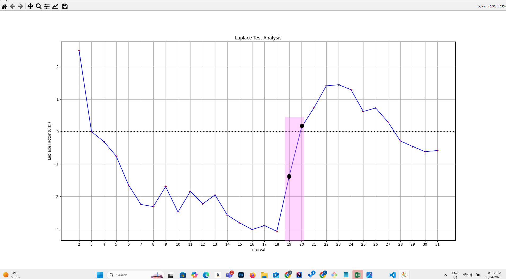
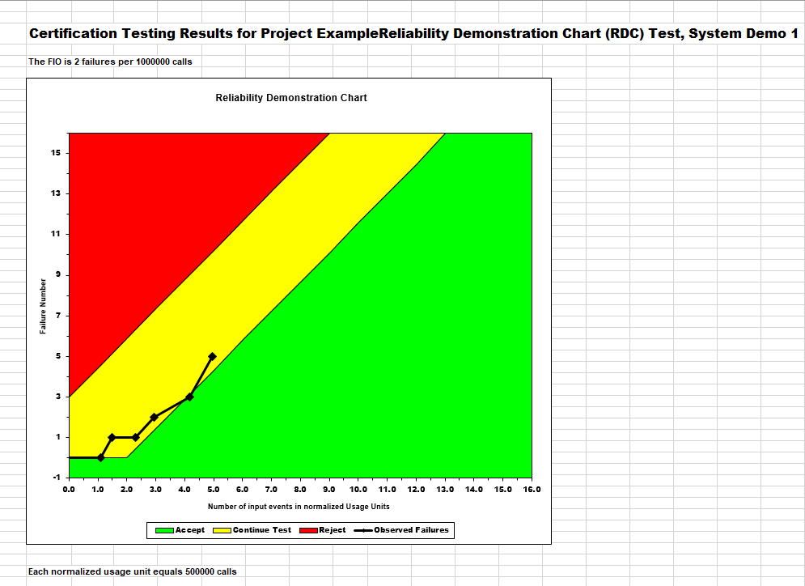
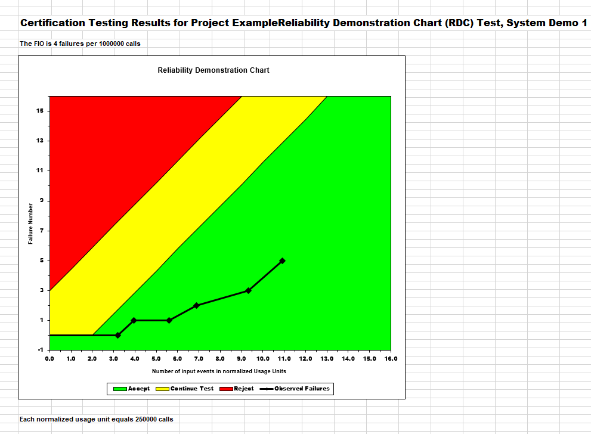
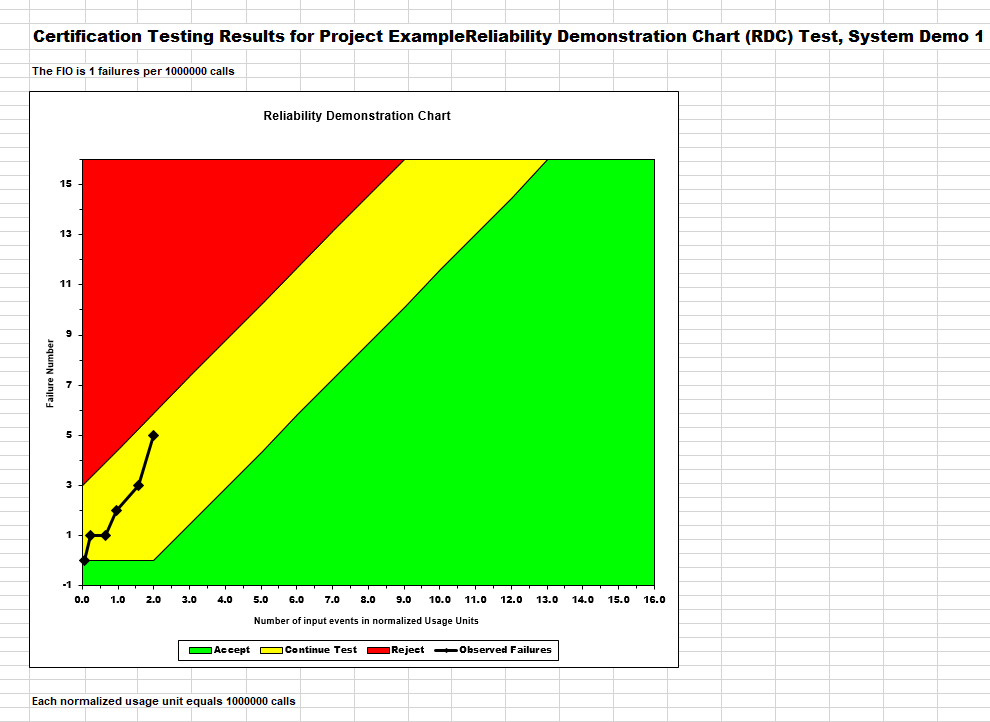

**SENG 637- Dependability and Reliability of Software Systems***

**Lab. Report \#5 – Software Reliability Assessment**

| Group: 14      |
|-----------------|
| Ayodele Oluwabusola        |   
| Gabriel Gabari             |   
| Remi Oyediji               |   
| Taiwo Oyewole              | 

# Introduction
In this lab report, our group analyzed failure data from a hypothetical system using two key methods: Reliability Growth Testing and the Reliability Demonstration Chart (RDC). These methods helped us understand how system reliability changes and improves during testing. 
We used "C-SFRAT" to track failure rates and reliability over time. Since the tool didn’t run properly on the Windows 10 PC that we used, we successfully ran it using **Oracle VM VirtualBox**. This hands-on experience helped us see the importance of reliability testing in real-world scenarios and better understand the tools used in the process.

We explore two main techniques for assessing system reliability: Reliability Growth Testing and the Reliability Demonstration Chart (RDC). These methods help us evaluate the overall quality and dependability of the System Under Test (SUT) using the provided failure data.
Here's how we broke it down:

1. Techniques used:
   - Reliability Growth Testing
   - Reliability Demonstration Chart (RDC)

2. What we analyzed:
   - How long the system ran (T)
   - How many failures were found (FC)
   - Time spent running tests (E)
   - Human effort to detect bugs (F)
   - Computer time used (C)

3. What we aimed to learn:
   - How the system’s reliability improves
   - How failure trends can guide decisions

These methods gave us insight into how reliable the system is and what areas may need more attention.

# Assessment Using Reliability Growth Testing 

### **2.1 Result of Model Comparison**

We used C-SFRAT to estimate failure trends across all available models and covariate combinations. The goal was to identify the two models that best fit the observed failure data. We evaluated each model based on **Akaike Information Criterion (AIC)** and **Bayesian Information Criterion (BIC)**. They indicate a better balance between model fit and complexity:

- **AIC (Akaike Information Criterion)**: Penalizes complexity mildly. Lower AIC means a better fit with fewer parameters.
- **BIC (Bayesian Information Criterion)**: Penalizes complexity more strongly. Lower BIC indicates a simpler, more generalizable model.

The top-performing models were:

- **Discrete Weibull Type III with covariate F** - best AIC and BIC.
- **Geometric with covariate F** - second best in both metrics.
  
Below is a snapshot of the comparison result from the tool. Highlighting the best two models with the lowest AIC and BIC metrics.

*Figure 1: Table showing models' comparison*

### 2.2 Result of Range Analysis

To determine which portion of the failure data is appropriate for further reliability analysis, a range analysis was performed by visual inspection of the cumulative plot of failures over time of the data provided in Excel. The dataset consists of timestamped failure instances collected during integration testing of a hypothetical software system. Based on our observations, the following insights were obtained:

**Initial Observation**
The early phase of the failure data shows a high concentration of failures occurring in short intervals. This typically reflects a system still undergoing active debugging and stabilization. As a result, the early data is likely skewed by immature components and setup issues that don’t represent long-term operational behavior.

**Stabilization Period**
A noticeable trend emerges as the system progresses through subsequent test intervals. The failure rate begins to decrease, and Mean Time To Failure (MTTF) gradually increases; a sign of reliability growth. This is also reflected in the C-SFRAT output, where the failure intensity curve flattens over time.

*Figure 2: Failure intensity plot of all selected models.*

This period, where failure intervals grow longer and more consistent, indicates that the software has reached a more stable operational phase. Hence, this middle-to-late portion of the dataset is ideal for proceeding with statistical reliability estimation, including model fitting and MTTF prediction.

**Reason for Range Selection**
Using this stable segment of the dataset allows:
- More accurate parameter estimation from the models.
- Better reliability predictions without distortion from unstable early-stage data

**Selection Confirmation**
To cross-check this range selection, we applied the **Laplace trend test** to determine the time interval range where failure intensity showed reliability growth (i.e., decreasing failures).

- The Laplace factor was **negative from interval 1 to 19**, indicating improving reliability. However, we extended the range to **interval 1 to 21**, even though intervals 20 and 21 had near-zero Laplace values. Including them improved model accuracy without introducing noise.

*Figure 3: Line plot of Laplace factor across intervals — highlight transition from negative to near-zero around interval 19–21.*

### 2.3 Plots for Failure Rate and Reliability of the SUT for the Test Data Provided

Using the C-SFRAT tool, the failure data was analyzed to visualize how the system under test (SUT) evolves in terms of failure behavior and reliability. The plots help in understanding how the software matures over time and whether the reliability objectives are being met.

**Failure Rate Plot**

The **failure rate plot** generated by C-SFRAT shows how the rate of software failures changes over the test duration. In this analysis:

- The **initial phase** shows a steep failure rate, indicating a high density of faults during early integration.
- As time progresses and faults are fixed, the failure rate gradually **decreases**, a sign of **reliability growth**.
- The curve eventually flattens, suggesting the system is reaching a more **stable state**.

*Figure 4: The figure illustrates cumulative failures vs. time (generated from C-SFRAT), highlighting the early dense failure region*

Using the selected models (DW3(F), GM(F)) and the 21-point range, we plotted:

*Figure 5: Cumulative Failure (MVF) of best models showing total failures over time*

These plots allow us to **quantify** the SUT's improvement and determine whether the system is mature enough for deployment or requires further testing.

In conclusion, both the failure rate and reliability plots confirm the system's reliability is increasing over time, and support decisions regarding test sufficiency and release readiness.

### **2.4 Decision Making with Target Failure Rate (5 marks)**

In the context of software reliability testing, decision making based on a target failure rate is crucial for determining whether the system under test (SUT) meets the desired reliability criteria and if further testing or modifications are necessary.  

The target failure rate is typically defined as the maximum allowable number of failures or failures per unit of time (e.g., failures per hour or failures per cycle) that the system can endure before it is considered unreliable. It is usually established based on the system’s requirements, the criticality of the software, and industry standards or benchmarks.

We tested model predictions by setting failure intensity targets:

- **Target = 0.3**:
  - **GM(F)**: Needs **59 more intervals**.
  - **DW3(F)**: Already meets the target — needs **0 intervals**.

- **Target = 2.5**:
  - **GM(F)**: Needs **5 more intervals**.
  - **DW3(F)**: Needs **6 more intervals**.

**Interpretation**: DW3(F) is more aggressive and reaches reliability targets faster. GM(F) is more conservative but stable.

   
    

*Figure 6: side-by-side bar charts or line graphs for model response to target failure rates of 0.3 and 2.5.*

In real-world applications, companies set acceptable failure rates (e.g., 2 failures/interval). By comparing our model predictions with target rates, we can determine if the system meets these standards.

### 2.5 Advantages and Disadvantages of Reliability Growth Analysis

 **Advantages**

1. **Spotting Problems Early**: 
   Reliability growth analysis helps catch issues early in the testing phase. By watching how failures trend, we can fix problems before they turn into bigger ones, ultimately improving the system’s performance.

2. **Better Predictions**: 
   This analysis helps predict how reliable the system will be over time. With this info, it’s easier to plan resources and manage risks, ensuring that the system stays reliable as it moves through different stages.

3. **Helps Design Decisions**: 
   The insights from the analysis can guide engineers on which parts of the system need more work. It makes sure that we’re focusing on the areas that will have the biggest impact on reliability.

4. **Data-Driven**: 
   Since this analysis is based on actual failure data, it gives us something solid to rely on when making decisions, instead of just guessing or assuming things about how the system will behave.

**Disadvantages**

1. **Picking the Right Model**: 
   Choosing the right model for the analysis can be tricky. Not all systems are the same, and using the wrong model might give us misleading results. You need to really understand the system to pick the right one.

2. **Need for Lots of Data**: 
   Reliability growth analysis works best with a lot of failure data over time. But if you’re working with a new system or one that hasn’t been tested enough, it can be tough to get enough data, making the analysis less useful.

3. **Assumptions Can Be Off**: 
   Many models make assumptions about how failures should behave, but these don’t always match up with real-world situations. This means the predictions might not always be accurate if the assumptions don’t fit the actual failure patterns.

4. **Time-Consuming**: 
   Running the analysis, especially when you have a lot of intervals or complex models, can take a long time. If you’re in a rush and need quick decisions, it might not be the most efficient method to use.

# Assessment Using Reliability Demonstration Chart 

For this part of the lab, the RDC-11 tool was used to test the system under test (SUT). This tool is vital in quantifying how confident we can be in a model’s performance over time, especially when making decisions about model deployment or system integration.
Before using the tool, the failure data had to be prepared.

## Setup and Data Normalization

The raw dataset provided from the lab had key reliability metrics like Failure Count (FC) and Execution Time (E), but the values were inconsistent and scattered across different time intervals. This inconsistency made it hard to generate a meaningful Reliability Demonstration Chart (RDC), as the failure events were not aligned in a clear cumulative format needed for proper analysis.

To solve this, the data had to be normalized; specifically, by calculating:

- Cumulative Failure Count
- Cumulative Execution Time
 
These values are essential for creating a smooth and interpretable RDC curve.

**Code Reference**

The normalization was performed using a simple Python script.  
📄 [normalization.py](./normalization.py)

This script loads the data, computes cumulative values, and prepares it for plotting or analysis.

**Output result for testing**

| T  | Cumulative FC | Cumulative Time |
|----|----------------|------------------|
| 1  | 2              | 0.05             |
| 2  | 13             | 1.05             |
| 3  | 15             | 1.24             |
| 4  | 19             | 1.65             |
| 5  | 22             | 1.97             |
| 6  | 23             | 2.58             |
| 7  | 24             | 2.90             |
| 8  | 26             | 4.73             |
| 9  | 30             | 7.74             |
| 10 | 30             | 9.53             |

## 3 plots for MTTFmin, twice and half of it for your test data

We explored three scenarios by tweaking the MTTF (Mean Time To Failure) values:

**1. Minimum MTTF that Makes the System Acceptable**

MTTF = 2
Scenario: Allowed 4 failures over 8 hours (MTTF = 2).

Result: The system landed in the continue (yellow) region, meaning it wasn't fully accepted but didn’t fail outright either.

Under moderate failure tolerance, the system showed some promise but not full reliability.

*Figure 7: MTTFmin set to two(2)*

**2. Double the Minimum MTTF**

MTTF = 4
Scenario: Required 1 failure every 4 hours (MTTF = 4).

Result: Points moved into the accept (green) region, indicating the system met this stricter requirement.

Surprisingly, the system performed better under a higher MTTF, suggesting a good reliability trend in this test.

*Figure 8: MTTF Value Doubled*

**3. Half the Minimum MTTF**

MTTF = 1
Scenario: Allowed 7 failures in 7 hours (MTTF = 1).

Result: Performance dropped back to the yellow region.

This shows the system struggles with too lenient failure allowances, possibly due to how failures cluster in time.
   

*Figure 9: MTTF Value Halfed*

## Explain your evaluation and justification of how you decide the MTTFmin

We tested different MTTF values using RDC to see how the system would respond. The idea was to find the **lowest MTTF** that still keeps the system from getting rejected.

When we tried **MTTF = 2**, the plot landed in the **yellow (continue) zone**, not fully accepted, but not rejected either. That made it the **lowest safe zone** we could aim for. Anything lower than 2 pushed us straight into the red, so *MTTF = 2 became our MTTFmin*.

Though **MTTF = 4** gave a green pass, which is great, but that’s a much **stricter condition** fewer failures allowed over more time. It’s good for showing the system is solid, but not what we’d call the minimum threshold.

So in the end, we went with **MTTF = 2** as our baseline because:
- It’s the lowest that doesn’t trigger rejection.
- It marks the line between unreliable and *maybe acceptable*.
- It gives the system a fair chance without setting the bar too high.

### Advantages and Disadvantages of the Reliability Demonstration Chart (RDC)

**Advantages**
- Shows the system’s reliability at a glance.
- Simple to interpret once the failure data is ready.
- Helps avoid extra testing by stopping early when a clear result is reached.
- Useful for determining product readiness.

**Disadvantages**
- Only shows if the system meets the threshold, not how reliable it actually is.
- If input values are wrong, the results can be misleading.
- The tool may only accept a small number of data points.

# Comparison of Results
Both test tools require failure data to test the reliability of the system. In Part 1 - using C-SFRAT, we found that the system required further testing to improve its reliability, as the calculated MTTF was above the acceptable threshold. In Part 2 - using RDC, the analysis similarly indicated that the system did not meet the predefined reliability standard, with failure rates exceeding acceptable limits. However, RDC provided a clear visual representation of failure points in the Accept, Continue, and Reject regions, while RGT helped model and predict future failure scenarios.

Both methods agreed that system improvements were needed, though RGT focused on iterative improvements, while RDC gave a snapshot of whether the system met reliability goals.

# Discussion on Similarities and Differences of the Two Techniques

**Similarities:**

Both techniques assess system reliability using failure data.

Data quality is crucial for accurate results.

The goal is continuous reliability improvement.

**Differences:**

RGT is iterative, refining the system over multiple test phases; RDC provides a final evaluation of whether reliability targets are met.

RGT is more flexible, predicting reliability across tests, while RDC is rigid, evaluating a system’s compliance at a specific moment.

RGT focuses on failure modes, while RDC is used for final validation against predefined targets.

# How the team's work/effort was divided and managed

The team worked collaboratively throughout the entire project, with each member contributing to different aspects. 

The final report was a collaborative effort, with each team member contributing to different sections.

**Communication & Collaboration**: Regular meetings (both in-person and virtual) and a shared online document kept the team updated on progress, and allowed us to address challenges together. This approach ensured effective communication and a smooth workflow throughout the project.

# Difficulties encountered, challenges overcome, and lessons learned

**Difficulties Encountered:**

- The main challenge was running the reliability growth software, which wasn’t compatible with the test PC's current OS. This delayed the analysis.
- Working with the raw data for RDC posed a challenge, as a result of the irregular data distribution of the output of the experiment wasn't making sense.

**Challenges Overcome:**

- For RGT, we explored using a virtual machine (VM) to run the software in a compatible environment. This workaround allowed us to proceed with the analysis.
- Converting raw failure data into a format suitable for RDC required careful normalization and cumulative calculations.

**Lessons Learned:**

- Data Quality: Accurate failure data is critical for reliable analysis in both methods.

- Complementary Methods: Combining RGT and RDC gives a more complete view of system reliability, one for modelling improvement, the other for final validation.

- Target Setting: Proper MTTF and failure intensity objectives are key for realistic reliability goals.

# Comments/feedback on the lab itself

- The instructions and guidelines for this assignment were clear and well-structured, making it easier to understand and implement the test cases effectively.
- It provided an in-depth understanding and  hands-on experience in reliability assessment and system failure interpretation.
